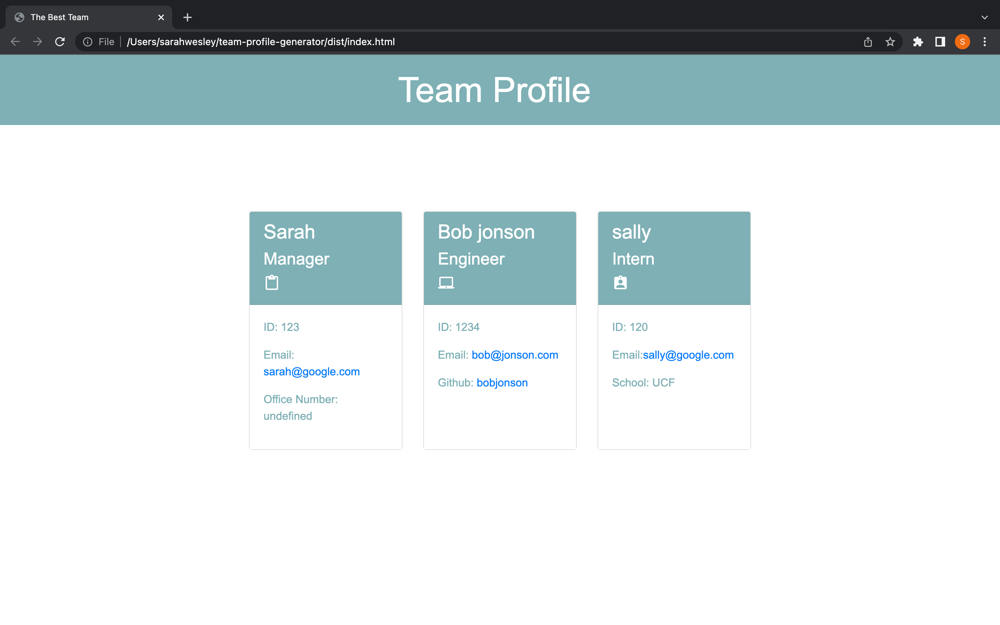

# Team Profile Generator

# Purpose
## This CLI application utilizes Inquirer, Jest and FS node packages to accept user input and generate a Team profile following the questions. The Team's website is styled and ready to go when all team members are added. a sample HTML is in [this folder](dist/index.html). Clone this application, run npm i. once installed run npm jest to see all tests pass. run node index.js to start your team profile.
  

# [Walkthrough Video Link](https://drive.google.com/file/d/1FUaEkHXbZLANorkkQ_XiQ35VpJUeXv1a/view)
# [Github Repo](https://github.com/sarahwesley/team-profile-generator)

#  
# 

# Languages
  

## Node, JS, Inquirer, FS, Bootstrap, google fonts

## Made with <3 Sarah Wesley
